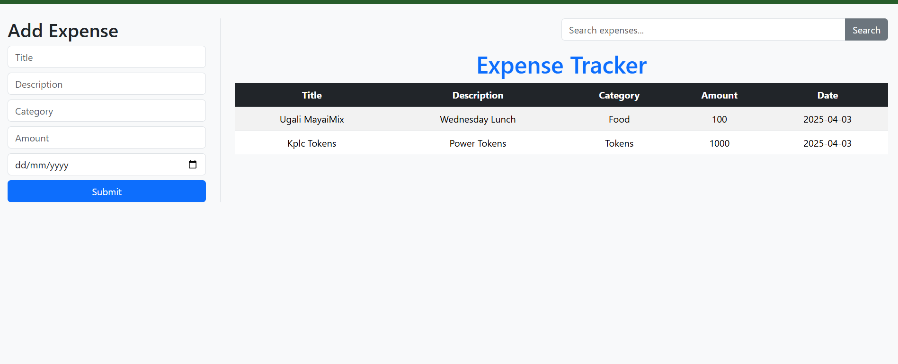

# Expense Tracker App

A simple and responsive React app that allows users to track their expenses, add new ones using a form, and search through them in real-time.

---

## Features

- View a list of expenses in a table.
- Add new expenses using a user-friendly form.
- Filter expenses using a search bar.
- Clean and minimal UI built with Bootstrap CSS.

---

## Built With

- [React](https://reactjs.org/) – For building the user interface.
- [Bootstrap CSS](https://https://getbootstrap.com/) – For styling the components.

---

## Getting Started

Follow these steps to run the project on your local machine:

### 1. Clone the repo
git clone https://github.com/ChadKoo/expense-tracker.git
cd expense-tracker

2. Install dependencies using; npm install

3. Start the development server using npm run dev,

Users can fill out the form on the left to add a new expense. The added expense shows up instantly in the table. They can also filter through expenses using the search bar.

## Concepts Used
useState for managing:

The list of expenses

The form values

The search input

filter() to search through expenses

Controlled components (value and onChange in inputs)

React event handling

## Author
Made by Chadwick Koo

